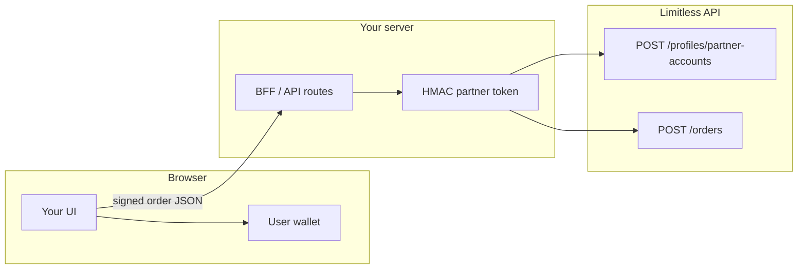

The Programmatic API enables partners to build integrations that create and manage user accounts, place orders on behalf of users, and operate with fine-grained access control — all through HMAC-authenticated API tokens with scoped permissions.

<Warning>
  HMAC credentials contain a secret key and must only be used in **backend or BFF** environments. Never expose them in browser-side code.
</Warning>

## Recommended architecture

<Info>
  **Recommended setup for production integrations:**

  - **Store the real HMAC credentials on your backend.** The `tokenId` and `secret` should never leave your server infrastructure.
  - **Use the SDK server-side to sign partner-authenticated requests.** All trading, account creation, and delegated signing calls should be made from your backend.
  - **Expose only your own app-specific endpoints to the frontend.** Your frontend talks to your backend API — your backend talks to the Limitless API.
  - **Keep public market reads in the browser.** Unauthenticated endpoints like market data and orderbooks can be called directly from the frontend.
</Info>

## Overview

The programmatic API introduces three capabilities:

| Capability | Description |
|------------|-------------|
| **Scoped API tokens** | HMAC-SHA256 authenticated tokens with granular scopes (`trading`, `account_creation`, `delegated_signing`) |
| **Partner sub-accounts** | Create and manage user profiles linked to your partner account |
| **Delegated signing** | Submit orders without end users managing private keys — the server signs via a managed wallet |

## Partner lifecycle

<Steps>

<Step title="Bootstrap your partner account">
  Create a standard Limitless account by logging in with your wallet at [limitless.exchange](https://limitless.exchange). This gives you a `profileId` and wallet address.
</Step>

<Step title="Get partner capabilities enabled">
  Apply for programmatic API access. The team will review your application and enable token management and allowed scopes on your account.

  <Card title="Apply for Programmatic API Access" icon="arrow-up-right-from-square" href="https://docs.google.com/forms/d/e/1FAIpQLSd1P4UB1yDcdcxJzRrM7EiwuJKTFpKtqgFGA_ftYbNOLg7lsQ/viewform">
    Fill out the partner application form to get started. You'll need your Limitless wallet address from Step 1.
  </Card>
</Step>

<Step title="Derive a scoped API token">
  Authenticate with your Privy identity token and call `POST /auth/api-tokens/derive` to create a scoped token. The response includes a `tokenId` and `secret` — store the secret securely, it is only returned once.

<CodeGroup>

```typescript TypeScript
import { Client, HMACCredentials } from '@limitless-exchange/sdk';

const client = new Client({
  baseURL: 'https://api.limitless.exchange',
});

const derived = await client.apiTokens.deriveToken(identityToken, {
  label: 'my-trading-bot',
  scopes: ['trading', 'account_creation', 'delegated_signing'],
});

const scopedClient = new Client({
  baseURL: 'https://api.limitless.exchange',
  hmacCredentials: {
    tokenId: derived.tokenId,
    secret: derived.secret,
  },
});
```

```python Python
from limitless_sdk import Client, HMACCredentials, DeriveApiTokenInput

client = Client(base_url="https://api.limitless.exchange")

derived = await client.api_tokens.derive_token(
    identity_token,
    DeriveApiTokenInput(
        label="my-trading-bot",
        scopes=["trading", "account_creation", "delegated_signing"],
    ),
)

scoped_client = Client(
    base_url="https://api.limitless.exchange",
    hmac_credentials=HMACCredentials(
        token_id=derived.token_id,
        secret=derived.secret,
    ),
)
```

```go Go
import "github.com/limitless-labs-group/limitless-exchange-go-sdk/limitless"

client := limitless.NewClient()

derived, err := client.ApiTokens.DeriveToken(ctx, identityToken, limitless.DeriveApiTokenInput{
    Label:  "my-trading-bot",
    Scopes: []string{"trading", "account_creation", "delegated_signing"},
})

scopedClient := limitless.NewClient(
    limitless.WithHMACCredentials(limitless.HMACCredentials{
        TokenID: derived.TokenID,
        Secret:  derived.Secret,
    }),
)
```

</CodeGroup>
</Step>

<Step title="Create sub-accounts">
  Use the scoped token to create sub-accounts for your end users. Choose server wallet mode for Web2 integrations (delegated signing) or EOA mode for Web3 users who manage their own keys.

```typescript
const account = await scopedClient.partnerAccounts.createAccount({
  displayName: 'user-alice',
  createServerWallet: true,
});
// account.profileId, account.account
```
</Step>

<Step title="Trade on behalf of sub-accounts">
  With the `delegated_signing` scope and server wallet accounts, submit unsigned orders — the server signs them automatically. GTC (resting limit), FAK (fill-and-kill limit), and FOK (fill-or-kill market) order types are supported.

  **GTC order** — stays on the orderbook until filled or cancelled:

```typescript
import { OrderType, Side } from '@limitless-exchange/sdk';

const gtcOrder = await scopedClient.delegatedOrders.createOrder({
  marketSlug: 'btc-100k',
  orderType: OrderType.GTC,
  onBehalfOf: account.profileId,
  args: {
    tokenId: market.tokens.yes,
    side: Side.BUY,
    price: 0.55,
    size: 10,
    postOnly: true, // Optional for GTC only
  },
});
```

  **FAK order** — matches immediately up to available size and cancels any remainder:

```typescript
const fakOrder = await scopedClient.delegatedOrders.createOrder({
  marketSlug: 'btc-100k',
  orderType: OrderType.FAK,
  onBehalfOf: account.profileId,
  args: {
    tokenId: market.tokens.yes,
    side: Side.BUY,
    price: 0.45,
    size: 10,
  },
});
```

  **FOK order** — executes immediately at market price or is cancelled entirely:

```typescript
const fokOrder = await scopedClient.delegatedOrders.createOrder({
  marketSlug: 'btc-100k',
  orderType: OrderType.FOK,
  onBehalfOf: account.profileId,
  args: {
    tokenId: market.tokens.yes,
    side: Side.BUY,
    makerAmount: 10, // spend 10 USDC
  },
});
```
</Step>

</Steps>

## Scopes

| Scope | Description | Self-service |
|-------|-------------|--------------|
| `trading` | Place and cancel orders. Default scope. Required base for `delegated_signing`. | Yes |
| `account_creation` | Create sub-account profiles linked to the partner. | Yes |
| `delegated_signing` | Server signs orders on behalf of sub-accounts via managed wallets. Must be paired with `trading`. | Yes |
| `withdrawal` | Transfer ERC20 balances from managed server-wallet sub-accounts to the partner's own addresses. | Yes |
| `admin` | Access admin-protected endpoints. | No (admin-provisioned only) |

## Scope requirements by operation

| Operation | Required scopes |
|-----------|----------------|
| Place or cancel orders (`POST /orders`) | `trading` |
| Create sub-accounts (`POST /profiles/partner-accounts`) | `account_creation` |
| Create sub-accounts with server wallets (`createServerWallet: true`) | `account_creation` + `delegated_signing` |
| Submit unsigned orders (server signs) | `trading` + `delegated_signing` |
| Redeem resolved positions (`POST /portfolio/redeem`) | `trading` |
| Withdraw funds (`POST /portfolio/withdraw`) | `withdrawal` |

## Sub-account modes

### Server wallet (Web2 partners)

Set `createServerWallet: true` when creating a sub-account. The server provisions a managed Privy wallet and links it to the profile. The partner submits unsigned orders and the server signs them via the managed wallet. Token approvals are provisioned automatically.

<Warning>
  Server wallet mode requires both `account_creation` and `delegated_signing` scopes on your API token.
</Warning>

#### Lifecycle after a trade

For server wallet sub-accounts, it helps to treat **trading**, **market resolution**, and **redemption** as separate stages:

1. **Order execution** - Place and cancel orders through [`POST /orders`](/api-reference/trading/create-order) or the SDK `DelegatedOrderService`.
2. **Portfolio resolution state** - Portfolio endpoints such as [`GET /portfolio/positions`](/api-reference/portfolio/positions) and [`GET /portfolio/{account}/positions`](/api-reference/public-portfolio/positions) may later show `status: RESOLVED` and `winningOutcomeIndex` once the winning side is known.
3. **On-chain payout settlement** - Winning positions become redeemable only after the underlying conditional token payout has been reported on-chain.

<Warning>
  `status: RESOLVED` and `winningOutcomeIndex` in the portfolio response do **not** by themselves guarantee that the underlying conditional token position is already redeemable on-chain. Resolution in the API can appear before the CTF condition has been settled on-chain.
</Warning>

If your integration checks settlement directly on-chain, wait until the payout vector has been posted before attempting redemption. For CTF-based positions, a condition is not yet settled if `payoutDenominator(conditionId)` is still `0`.

#### Redemption and withdrawal support

Server wallet partner flows now include direct endpoints for payout settlement and treasury movement:

- [`POST /portfolio/redeem`](/api-reference/portfolio/redeem) to submit `redeemPositions` for a resolved condition.
- [`POST /portfolio/withdraw`](/api-reference/portfolio/withdraw) to transfer ERC20 funds from a managed sub-account server wallet to the partner's own account or smart wallet.

Current status:

- SDK helper methods for these routes are not yet available.
- Use direct REST calls (HMAC or authenticated session/Privy) for now.
- Keep these flows backend-managed while SDK coverage is pending.

### EOA (Web3 partners)

Omit `createServerWallet` or set it to `false`. The partner proves wallet ownership using `x-account`, `x-signing-message`, and `x-signature` on `POST /profiles/partner-accounts`. The end user keeps their private key in their own wallet and signs each order (EIP-712) themselves — Limitless never holds their key.

Scopes: `trading` and `account_creation` are sufficient for EOA partner flows. You do **not** need `delegated_signing` unless you also use [server wallet](#server-wallet-web2-partners) sub-accounts.

#### End-to-end flow

1. **Register the user's wallet (once per address)** — `POST /profiles/partner-accounts` with [EOA headers](/api-reference/partner-accounts/create-partner-account). The response returns `profileId` and the wallet `account`. If a profile already exists for that address, the API returns `409 Conflict` — your app should reuse the stored `profileId` instead of re-registering.
2. **Persist the mapping in your backend** — save at least `walletAddress → profileId` (and your own user id if you have one). You are **not** storing a Limitless “session object”; you are storing your app’s record so you know which `profileId` to pass on orders. See [What to persist](#what-to-persist-for-eoa-partners) below.
3. **User signs each order** — build the order per [EIP-712 signing](/developers/eip712-signing) and have the user sign in the browser (e.g. wagmi/viem/ethers). `maker` and `signer` must be the user’s EOA address.
4. **Submit the order from your backend (HMAC)** — `POST /orders` with HMAC auth, `onBehalfOf` set to the user’s `profileId`, and **`ownerId` set to that same `profileId`** when you send a **signed** order body. The `order`’s `maker` / `signer` must match the sub-account wallet. (If you use **delegated signing** with an unsigned `order`, the server sets `ownerId` for you — that path is for server-wallet sub-accounts, not pure EOA signing.)

#### Common EOA auth error

If `POST /orders` returns `Signer does not match authenticated profile account`, check all three fields point to the same user account:

- `ownerId` = user's `profileId`
- `onBehalfOf` = same user's `profileId`
- `order.maker` and `order.signer` = that user's wallet address

Using the partner profile ID in `ownerId` while signing with a user wallet causes this error.

#### Architecture (browser + backend)

Typical layout for a Next.js (or any SPA) app:

- **Browser:** connect wallet (e.g. wagmi + RainbowKit); sign the ownership proof for step 1; sign EIP-712 orders for step 3. Never put partner HMAC secrets in client bundles.
- **Backend (Next.js Route Handlers, server actions, or a separate API):** holds the scoped token `tokenId` / `secret`; signs every request to `api.limitless.exchange` with HMAC; forwards `POST /orders` after the client submits the signed order payload (or proxies market data as needed).



There is **no official Next.js sample app** in the public GitHub org today; use the [TypeScript SDK](/developers/sdk/typescript/api-tokens) on the server with the pattern above. Generic Node examples in [Quickstart: Node.js](/developers/quickstart/nodejs) illustrate HMAC and orders — swap in partner `hmacCredentials` and `partnerAccounts.createAccount` for EOA registration.

#### What to persist for EOA partners

| Store in your DB | Why |
|------------------|-----|
| User’s wallet address and Limitless **`profileId`** | Needed for `onBehalfOf` / `ownerId` on every `POST /orders` for that user. |
| Optional: `feeRateBps` / profile metadata | You can refetch from the API if needed. |

| Do **not** rely on storing | Notes |
|-----------------------------|--------|
| The user’s **private key** | Not required and not recommended; the wallet stays in the user’s client. |
| A Limitless “login session” to avoid **order** signing | EOA mode requires an **EIP-712 signature per order** (or a new signing policy you implement). You can avoid repeated **registration** by persisting `profileId`. |
| Partner HMAC `secret` in the browser | Forbidden — keep only on the server. |

<Warning>
  There is no partner endpoint to list or lookup previously created sub-accounts by wallet address. `GET /profiles/{account}` returns only the authenticated account's own profile. Treat `walletAddress -> profileId` persistence as required integration state.
</Warning>

**Wallet UX:** Standard wallet connectors remember the user’s connection across visits, so users don’t necessarily “reconnect from scratch” every time — but **each order** still needs a signature unless you move to [server wallet + delegated signing](#server-wallet-web2-partners).

## Delegated order types

Delegated orders support three execution strategies:

### GTC (Good-Til-Cancelled)

Limit orders that rest on the orderbook at a specified price until they are filled or explicitly cancelled. Use `price` and `size` to specify the order.

| Parameter | Description |
|-----------|-------------|
| `price` | Price between 0 and 1 |
| `size` | Number of contracts |
| `postOnly` | Optional. When `true`, the order is rejected if it would immediately match against existing orders. Guarantees maker-only execution. Default `false`. |

### FAK (Fill-And-Kill)

Limit orders that use `price` and `size` like GTC but only match immediately available liquidity. Any unmatched remainder is cancelled.

| Parameter | Description |
|-----------|-------------|
| `price` | Price between 0 and 1 |
| `size` | Number of contracts |

### FOK (Fill-Or-Kill)

Market orders that execute immediately at the best available price or are cancelled entirely — no partial fills. Instead of `price` and `size`, FOK orders use `makerAmount`.

| Parameter | Description |
|-----------|-------------|
| `makerAmount` | **BUY**: USDC amount to spend (e.g., `50` = spend $50 USDC). **SELL**: number of shares to sell (e.g., `18.64` = sell 18.64 shares). |

<CodeGroup>

```typescript TypeScript
import { OrderType, Side } from '@limitless-exchange/sdk';

// FAK BUY — fill immediately up to 10 shares at 0.45, cancel remainder
const response = await scopedClient.delegatedOrders.createOrder({
  marketSlug: 'btc-100k',
  orderType: OrderType.FAK,
  onBehalfOf: account.profileId,
  args: {
    tokenId: market.tokens.yes,
    side: Side.BUY,
    price: 0.45,
    size: 10,
  },
});

if (response.makerMatches?.length) {
  console.log(`Matched immediately with ${response.makerMatches.length} fill(s)`);
} else {
  console.log('No immediate fill. Remainder was cancelled.');
}
```

```python Python
response = await scoped_client.delegated_orders.create_order(
    token_id=str(market.tokens.yes),
    side=Side.BUY,
    order_type=OrderType.FAK,
    market_slug="btc-100k",
    on_behalf_of=account.profile_id,
    price=0.45,
    size=10.0,
)

if response.maker_matches:
    print(f"Matched immediately with {len(response.maker_matches)} fill(s)")
else:
    print("No immediate fill. Remainder was cancelled.")
```

```go Go
response, err := scopedClient.DelegatedOrders.CreateOrder(ctx, limitless.CreateDelegatedOrderParams{
    MarketSlug: "btc-100k",
    OrderType:  limitless.OrderTypeFAK,
    OnBehalfOf: account.ProfileID,
    Args: limitless.FAKOrderArgs{
        TokenID: market.Tokens.Yes,
        Side:    limitless.SideBuy,
        Price:   0.45,
        Size:    10.0,
    },
})

if len(response.MakerMatches) > 0 {
    fmt.Printf("Matched immediately with %d fill(s)\n", len(response.MakerMatches))
} else {
    fmt.Println("No immediate fill. Remainder was cancelled.")
}
```

```typescript TypeScript
import { OrderType, Side } from '@limitless-exchange/sdk';

// FOK BUY — spend 1 USDC at market price
const response = await scopedClient.delegatedOrders.createOrder({
  marketSlug: 'btc-100k',
  orderType: OrderType.FOK,
  onBehalfOf: account.profileId,
  args: {
    tokenId: market.tokens.yes,
    side: Side.BUY,
    makerAmount: 1,
  },
});

if (response.makerMatches?.length) {
  console.log(`Matched with ${response.makerMatches.length} fill(s)`);
} else {
  console.log('Not matched — cancelled automatically');
}
```

```python Python
response = await scoped_client.delegated_orders.create_order(
    token_id=str(market.tokens.yes),
    side=Side.BUY,
    order_type=OrderType.FOK,
    market_slug="btc-100k",
    on_behalf_of=account.profile_id,
    maker_amount=1.0,
)

if response.maker_matches:
    print(f"Matched with {len(response.maker_matches)} fill(s)")
else:
    print("Not matched — cancelled automatically")
```

```go Go
response, err := scopedClient.DelegatedOrders.CreateOrder(ctx, limitless.CreateDelegatedOrderParams{
    MarketSlug: "btc-100k",
    OrderType:  limitless.OrderTypeFOK,
    OnBehalfOf: account.ProfileID,
    Args: limitless.FOKOrderArgs{
        TokenID:     market.Tokens.Yes,
        Side:        limitless.SideBuy,
        MakerAmount: 1.0,
    },
})

if len(response.MakerMatches) > 0 {
    fmt.Printf("Matched with %d fill(s)\n", len(response.MakerMatches))
} else {
    fmt.Println("Not matched — cancelled automatically")
}
```

</CodeGroup>

## HMAC authentication

All day-to-day programmatic API calls use HMAC-SHA256 request signing. See the [Authentication](/developers/authentication#hmac-request-signing) page for the signing protocol, canonical message format, and code examples.

## API endpoints

| Endpoint | Auth | Description |
|----------|------|-------------|
| [`GET /auth/api-tokens/capabilities`](/api-reference/api-tokens/get-capabilities) | Privy | Check partner capability configuration |
| [`POST /auth/api-tokens/derive`](/api-reference/api-tokens/derive-token) | Privy | Create a scoped API token |
| [`GET /auth/api-tokens`](/api-reference/api-tokens/list-tokens) | Any | List active tokens |
| [`DELETE /auth/api-tokens/{tokenId}`](/api-reference/api-tokens/revoke-token) | Any | Revoke a token |
| [`POST /profiles/partner-accounts`](/api-reference/partner-accounts/create-partner-account) | HMAC | Create a sub-account |
| [`POST /orders`](/api-reference/trading/create-order) | HMAC | Place orders (with optional delegated signing) |
| [`POST /portfolio/redeem`](/api-reference/portfolio/redeem) | Any (`apiToken`, Privy, session) | Redeem resolved positions from a server wallet |
| [`POST /portfolio/withdraw`](/api-reference/portfolio/withdraw) | Any (`apiToken`, Privy, session) | Withdraw ERC20 funds from a server wallet |

## SDK support

All three official SDKs provide built-in support for the programmatic API:

<Info>
  Redemption and withdrawal are currently API-only for partner server-wallet flows (`POST /portfolio/redeem`, `POST /portfolio/withdraw`). SDK helper methods for these two routes are not yet available.
</Info>

<CardGroup cols={3}>
  <Card title="TypeScript" icon="js" href="/developers/sdk/typescript/api-tokens">
    `Client` with `hmacCredentials`, `ApiTokenService`, `PartnerAccountService`, `DelegatedOrderService`
  </Card>
  <Card title="Python" icon="python" href="/developers/sdk/python/api-tokens">
    `Client` with `hmac_credentials`, `api_tokens`, `partner_accounts`, `delegated_orders`
  </Card>
  <Card title="Go" icon="golang" href="/developers/sdk/go/api-tokens">
    `Client` with `WithHMACCredentials`, `ApiTokens`, `PartnerAccounts`, `DelegatedOrders`
  </Card>
</CardGroup>
